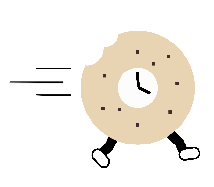

<!-- PROJECT LOGO -->
<div align="center">

</div>

<h1 align="center"> Quick Bagel </h1>
<p align="center">
"This guy <i>keeps</i> forgetting my bagels." <i> - Tom from Myspace </i>
<br/>
A mobile application for you to <b>streamline</b> errands and pay good deeds forward!
</p>

<!-- PROJECT SHIELDS -->


<!-- TABLE OF CONTENTS -->
<details>
  <summary> Table of Contents </summary>
  <ol>
  <!-- INTRO/PURPOSE OF APP -->
    <li>
      <a href="#about-the-app">About the App</a>
      <ul>
        <li>
        <a href="#tech-stack">Tech Stack</a>
        </li>
      </ul>
    </li>
    <!-- SETUP -->
    <li>
      <a href="#getting-started">Getting Started</a>
    </li>
    <!-- DEMO: VIDEO/SCREENSHOTS/CODE -->
    <li>
      <a href="#how-it-works">How it Works</a>
      <ul>
        <li><a href="#demo">Demo</a></li>
      </ul>
      <ul>
        <li>
        :clipboard:<a href="#testing">Testing</a>
        </li>
      </ul>
    </li>
    <!-- CHALLENGES -->
    <li>
      <a href="#challenges">Challenges</a>
    </li>
    <!-- RESEARCH -->
    <li>
      <a href="#research">Research</a>
      <ul>
        <li>
        :book:<a href="#user-stories">User Stories</a>
        </li>
      </ul>
    </li>
     <!-- FEATURES -->
    <li>
      <a href="#features">Features</a>
    </li>
     <!-- TEAM -->
    <li>
      <a href="#team">Team</a>
    </li>
     <!-- Resources -->
    <li>
      <a href="#resources">Resources</a>
    </li>
</ol>
</details> <!-- END OF TABLE OF CONTENTS DROP DOWN -->

## About the App

* What does the app do & why did we build it?


## Installation

1. Fork and then clone the repo.
```
git clone https://github.com/rpp30-boc-heartbleed/whimsical.git
```
2. Install NPM packages from the root directory and from the client directory.
```
npm install
```

## Getting Started

1. Start the server from the root directory and confirm connection to database.
```
npm start
```
2. Start the the application from the client directory.
```
expo start
```

3. To test run:
```
npm test
```
<p align="right">(<a href="#top">back to top</a>)</p>

## Tech Stack

### Frontend
* <a href='https://reactnative.dev/'>React Native</a>
* <a href='https://recoiljs.org/'>Recoil</a>


### Backend

* <a href='https://expressjs.com/'>Express</a>
* <a href="https://nodejs.org/en/">Node.js</a>


### Database
* <a href='https://www.mongodb.com/'>MongoDB</a>

<p align="right">(<a href="#top">back to top</a>)</p>


## How it Works


### Demo

<!-- Insert video, diagrams, and or graphics here -->

### API
|Request Type|Endpoint                          |Status |
|:----------:|----------------------------------|:-----:|
|    GET     | /qb/something                    |200    |
|    GET     | /qb/something                    |200    |
|    POST    | /qb/something                    |201    |
|    POST    | /qb/something                    |201    |
|    PUT     | /qb/something                    |204    |
|    PUT     | /qb/something                    |204    |
|    PUT     | /qb/something                    |204    |
|    PUT     | /qb/something                    |204    |


<p align="right">(<a href="#top">back to top</a>)</p>

## Challenges
:ocean: Technical Challenges

:bulb: Results Observed

<p align="right">(<a href="#top">back to top</a>)</p>

## Research
<a href="https://trello.com/b/yvrqtpK9/rpp30-boc-heartbleed">
Project Board
</a>

### User Stories
<a href="https://docs.google.com/spreadsheets/d/1heVGbScj-MP8areUMJkZk7aNSUPD_GR8Hwmd6uMnrQ8/edit#gid=484004821">
View stories >>
</a>

<p align="right">(<a href="#top">back to top</a>)</p>

## Features
- [ ] Placeholder Feature
- [ ] Placeholder Feature
- [x] Feature Implemented

<p align="right">(<a href="#top">back to top</a>)</p>

## Team
<a href="https://github.com/ryhorowitz?tab=repositories">
  
</a>
<a href="https://github.com/shabbyblue16?tab=repositories">
  
</a>
<a href="https://github.com/OjeikuA?tab=repositories">
  
</a>
<a href="https://github.com/aaronfife?tab=repositories">
  
</a>
<a href="https://github.com/surekhaw?tab=repositories">
  
</a>
<a href="https://github.com/Laweeza?tab=repositories">
  
</a>

<p align="right">(<a href="#top">back to top</a>)</p>

## Resources
* [Recoil](https://recoiljs.org/docs/introduction/installation)
* [React Native](https://reactnative.dev/docs/getting-started)
* [React-Native-Paper](https://callstack.github.io/react-native-paper/getting-started.html)
* [React-Native-Geolocation](https://github.com/Agontuk/react-native-geolocation-service)
* [Expo](https://docs.expo.dev/)
* [Shields](https://shields.io)
* [Github Markdown Cheatsheet](https://github.com/tchapi/markdown-cheatsheet)

<p align="right">(<a href="#top">back to top</a>)</p>