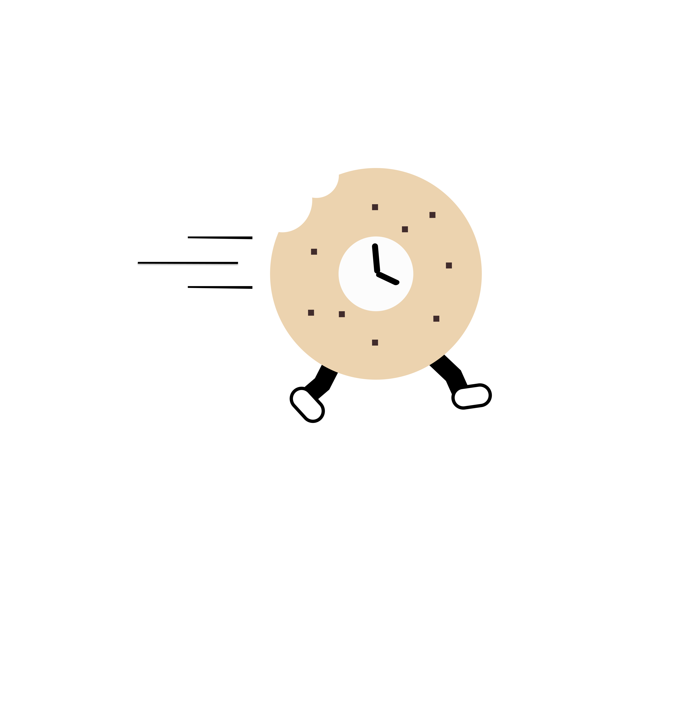

<div align="center">

</div>
<h1 align="center"> Quick Bagel </h1>


>'This guy keeps taking my bagels' - Tom from Myspace

A mobile application for you to <b>streamline</b> errands and pay good deeds forward!


## Table of Contents ##

1. [Introduction](#introduction)
2. [Installation](#installation)
3. [Tech Stack](#techstack)
    * [Frontend](#frontend)
    * [Backend](#backend)
    * [Database](#database)
4. [API](#api)
5. [Challenges](#challenges)
    * [Technical](#technical)
    * [Unexpected](#unexpected)
6. [Research](#research)
    * [Tests](#tests)
    * [CI/CD](#ci/cd)
    * [User Stories](#userstories)
    * [Tickets](#tickets)
    * [Project Board](#board)
7. [Demo](#demo)
    * [How it works](#apphow)
      * [Screenshots](#screenshots)
      * [Diagrams](#diagrams)
8. [Deployment](#deployment)
9. [Features](#features)
    * [Future Features](#futures)
10. [Team](#team)

## Introduction <a name="introduction"></a> ##

* What does the app do & why did we build it?

## Installation <a name="installation"></a> ##

```
`npm install` from the root directory and from the client directory.
```

```
`npm start` from the root directory to start server and confirm connection to database.
```

```
`expo start` from the client directory.
```

## Tech Stack <a name="techstack"></a> ##

### Frontend <a name="frontend"></a> ###
* <a href='https://reactnative.dev/'>React Native</a>


### Backend <a name="backend"> </a> ###
* <a href='https://expressjs.com/'>Express</a>
*  <a href="https://nodejs.org/en/">Node.js</a>


### Database <a name="database"></a> ###
* <a href='https://www.mongodb.com/'> MongoDB<a href='https://www.mongodb.com/'></a>

## API ##

|Request Type|Endpoint                          |Status |
|:----------:|----------------------------------|:-----:|
|    GET     | /qb/:something                   |200    |
|    GET     | /qb/:something                   |200    |
|    POST    | /qb/:something                   |201    |
|    POST    | /qb/:something                   |201    |
|    PUT     | /qb/something                    |204    |
|    PUT     | /qb/something                    |204    |
|    PUT     | /qb/something                    |204    |
|    PUT     | /qb/something                    |204    |

## Features <a name="features"></a> ##

## Team <a name="team"></a> ##
<a href="https://github.com/ryhorowitz">
  
</a>
<a href="https://github.com/shabbyblue16">
  
</a>
<a href="https://github.com/OjeikuA">
  
</a>
<a href="https://github.com/aaronfife">
  
</a>
<a href="https://github.com/surekhaw">
  
</a>
<a href="https://github.com/Laweeza">
  
</a>